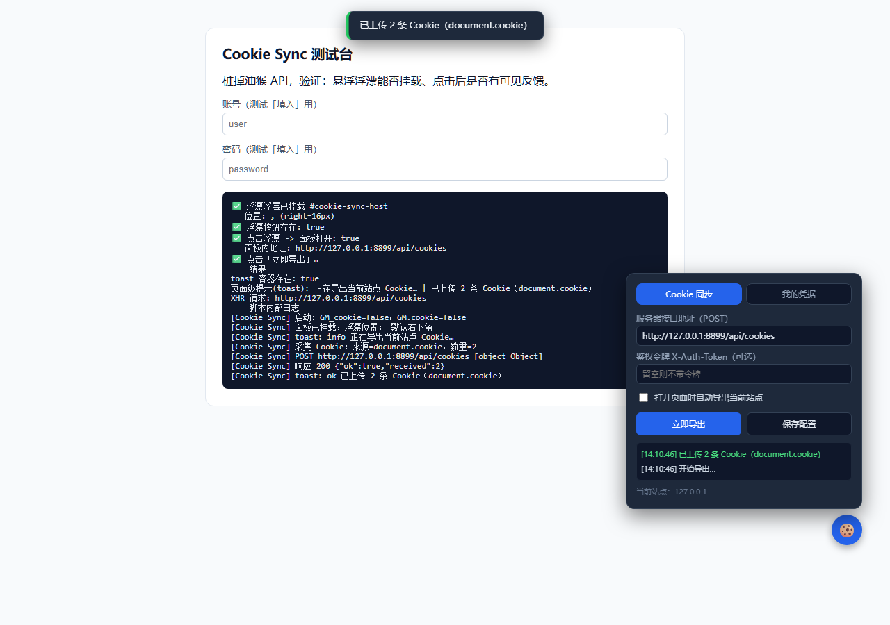

# Cookie Sync · Cookie 同步 & 个人凭据保险箱

读取浏览器「本地 Cookie / 当前网站 Cookie」，并通过油猴脚本推送到你**自建服务器**；
同时提供一个**个人凭据保险箱**，保存并一键填入**你自己账号**的登录凭据。



> ⚠️ **合规边界（务必遵守）**
> 本工具仅用于处理**你自己**的数据：导出**你自己账号**在**你自己设备**上的 Cookie，
> 或保存**你自己**的登录凭据。
> **不得**改写为在第三方页面收集**他人**输入的账号密码，不得伪装成目标网站的登录框。
> 这类「收集他人凭据」的行为属于钓鱼，违法，本项目不提供该能力。

---

## 目录结构

```
cookie-sync/
├── SKILL.md                 # 给 AI 的安装、部署和维护说明
├── cookie-sync.user.js      # 油猴脚本（Tampermonkey / Violentmonkey）
├── server/
│   ├── receiver.js          # 零依赖接收端（Node.js 原生 http）
│   ├── package.json
│   └── data/                # 接收到的 Cookie 落盘目录（自动生成）
├── deploy/                  # VPS 部署配置
│   ├── nginx-cookie-sync.conf   # Nginx 反代 + HTTPS
│   ├── cookie-sync.service      # systemd 常驻
│   ├── ecosystem.config.js      # PM2 备选
│   └── cookie-sync.env.example  # 环境变量模板
├── _test/
│   ├── harness.html             # 本地测试台（桩掉 GM_* API）
│   └── preview-*.png            # 界面截图
└── README.md
```

---

## 工作流程

```
浏览器页面                     油猴脚本                      你的服务器
  │  GM_cookie.list()            │                              │
  │ ─────── Cookie 列表 ───────► │                              │
  │  （读不到则回退 document.cookie）                             │
  │                              │  POST /api/cookies           │
  │                              │  X-Auth-Token: ***           │
  │                              │ ───────────────────────────► │
  │                              │        200 {ok:true}         │
  │                              │ ◄─────────────────────────── │
```

---

## 一、启动服务器

需要 Node.js（≥18，无需任何第三方依赖）。

```bash
cd cookie-sync/server

# 默认端口 8787，仅监听本机；TOKEN 必填
node receiver.js

# 启用令牌 + 自定义端口（推荐）
# Linux / macOS
PORT=9000 TOKEN=mysecret node receiver.js
# Windows CMD
set PORT=9000&& set TOKEN=mysecret&& node receiver.js
# Windows PowerShell
$env:PORT=9000; $env:TOKEN="mysecret"; node receiver.js
```

配置好 `TOKEN` 并启动后，可打开 `http://<服务器地址>:<端口>/admin` 查看已保存的 Cookie 快照。管理页使用与油猴客户端相同的 `TOKEN`，以 `X-Auth-Token` 请求服务端；令牌只保存在当前浏览器标签页会话中。Cookie 值默认隐藏，点击“显示”后才会展开。管理页为只读，不提供密码凭据展示。

启动后输出（默认 `text` 格式；设 `LOG_FORMAT=json` 则输出 JSON 行）：

```
[15:08:12] info  started  {"listen":"0.0.0.0:8787","tokenRequired":true,"logFormat":"text","dataDir":".../server/data"}
```

### 环境变量

| 变量 | 默认值 | 说明 |
| --- | --- | --- |
| `PORT` | `8787` | 监听端口 |
| `HOST` | `127.0.0.1` | 监听地址；远程部署应通过 HTTPS 反向代理访问 |
| `TOKEN` | 无 | 必填鉴权令牌；未设置时服务拒绝启动 |
| `DATA_DIR` | `server/data` | Cookie 与凭据保存目录 |
| `LOG_FORMAT` | `text` | 日志格式：`text` 或 `json` |
| `MAX_SNAPSHOTS_PER_SITE` | `20` | 每个站点保留的快照份数；`0` = 不限 |
| `RETENTION_DAYS` | `30` | 快照保留天数；`0` = 不按时间清理 |
| `DEDUP` | `1` | 相同 Cookie 内容是否跳过重复落盘；设 `0` 关闭 |

### 服务端行为

- **健康检查**：`GET /health`（无需令牌），返回 `uptimeSec` / `tokenRequired`，可直接给 systemd、Docker 或负载均衡当探针用。
- **去重**：内容指纹只看「站点 + Cookie 集合」，忽略 `exportedAt` 这类每次都变的字段。内容没变就不再写快照和 `cookies.jsonl`，响应里带 `duplicate:true`；`latest-<host>.json` 仍会刷新。
- **保留策略**：每次写入后按 `MAX_SNAPSHOTS_PER_SITE` 与 `RETENTION_DAYS` 清理旧快照（启动时也清一遍），避免 `data/` 无限增长。
- **优雅退出**：收到 `SIGTERM` / `SIGINT` 后停止接收新请求、写完在途数据再退出，5 秒兜底强退。systemd 重启、`docker stop` 都能安全收尾。
- **日志**：统一走 stdout（交给 systemd / PM2 / Docker 收集），可选 JSON 便于采集；鉴权失败会记录来源 IP。

**部署到远程服务器时**，记得在云厂商安全组 / 防火墙上放行对应端口，
并建议用 Nginx 反代 + HTTPS。

接口一览：

| 方法 | 路径 | 说明 |
| --- | --- | --- |
| GET | `/health` | 健康检查（无需令牌），返回 `{ok,uptimeSec,tokenRequired,time}` |
| GET | `/api/ping` | 同上，兼容旧调用 |
| GET | `/admin` | 只读管理页；仅在设置 `TOKEN` 后可读取 Cookie 数据 |
| GET | `/api/sites` | 获取已保存快照的站点、时间和 Cookie 数量；必须带 `X-Auth-Token`，且服务端必须设置 `TOKEN` |
| GET | `/api/cookies?site=example.com` | 获取该站点最新 Cookie；设置 `TOKEN` 后需带 `X-Auth-Token` |
| POST | `/api/cookies` | 接收 Cookie；设置 `TOKEN` 后需带 `X-Auth-Token` |
| POST | `/api/credentials` | 接收「你本人账号」凭据（`site`/`username`/`password`），同样需令牌 |

落盘文件（`server/data/`）：

- `cookies-<host>-<时间戳>.json` —— 内容变化时写一份快照（受保留策略约束）
- `latest-<host>.json` —— 该站点最新一份（总是覆盖）
- `cookies.jsonl` —— 追加式日志，内容未变则不追加
- `credentials-<host>.json` —— 凭据文件（**明文保存**，按账号归并）

---

## 二、安装油猴脚本

1. 浏览器安装 **Tampermonkey**（或 Violentmonkey）。
2. 新建脚本，把 `cookie-sync.user.js` 全文粘贴进去，保存。
3. 打开任意网站，右下角出现 🍪 悬浮按钮即为成功。

---

## 三、配置与使用

点右下角 🍪 打开面板：

| 项 | 说明 |
| --- | --- |
| **服务器接口地址** | 填 `http://<你的服务器IP>:<端口>/api/cookies`。本机测试填 `http://127.0.0.1:8787/api/cookies` |
| **鉴权令牌** | 必填，与服务端启动时的 `TOKEN` 一致 |
| **自动导出** | 勾选后每次打开页面自动推送当前站点 Cookie |

面板底部还有两个通用控件：

| 控件 | 说明 |
| --- | --- |
| **在页面显示浮漂** | 开关。关闭后页面上的 🍪 浮漂隐藏，需要时用油猴菜单「⚙️ 打开面板」临时调出，或菜单「🫥 显示 / 隐藏浮漂」再次切换。状态会保存，重启浏览器依然生效 |
| **×（标题栏右侧）** | 收起面板；若浮漂已关闭，收起后会一并隐藏 |

操作：

- **立即导出** —— 采集当前站点 Cookie 并推送，面板底部显示日志。
- **从服务器恢复** —— 拉取当前站点最新 Cookie，跳过过期或域名不匹配项并写入浏览器；完成后手动刷新页面。
- **保存配置** —— 写入油猴存储（`GM_setValue`），下次打开自动生效。

可以通过 Tampermonkey 菜单命令触发：

- `🍪 立即导出当前站点 Cookie`
- `↩️ 从服务器恢复当前站点 Cookie`
- `🔑 填入我的登录凭据`
- `⚙️ 打开面板` —— 浮漂被隐藏时也能调出
- `🫥 显示 / 隐藏浮漂` —— 快速切换浮漂显隐

### 隐藏 / 显示浮漂

不想让 🍪 挡住页面时：

1. 打开面板 → 底部取消勾选 **在页面显示浮漂**；或直接用菜单 `🫥 显示 / 隐藏浮漂`。
2. 浮漂隐藏后，**功能不受影响**——仍可通过菜单 `⚙️ 打开面板` 临时调出面板，用完点 `×` 收起，浮漂会继续隐藏。
3. 该开关状态保存在油猴存储里，重启浏览器后依然生效。

> 想彻底关闭脚本，请在 Tampermonkey 里禁用/删除本脚本，而不是只用这个开关。

---

## 四、Cookie 读取说明

脚本按以下顺序尝试，取到即止：

1. `GM_cookie.list({ url })` —— 读取**当前网站**全部 Cookie（可含 HttpOnly），首次使用 Tampermonkey 会弹窗请求授权；
2. `GM_cookie.list({ domain })` —— 按域名兜底；
3. `document.cookie` —— 最后回退，**读不到 HttpOnly Cookie**。

因此：

- 想导出**登录态等 HttpOnly Cookie**，必须允许 Tampermonkey 的 `GM_cookie` 权限；
- 若只显示少量 Cookie，通常是权限未授予、或该站 Cookie 多为 HttpOnly。

### 覆盖范围：多次查询合并，不是「取到就停」

`GM_cookie.list({ url })` 只返回**会发给当前 URL** 的 Cookie——它按 `path` 过滤，
所以 `path=/admin`、`path=/api` 这类会被漏掉；被上级域（`.example.com`）设置的 Cookie
也不在 `{ domain: www.example.com }` 的结果里。

所以脚本会把这些查询**全部执行并合并去重**：

```
{ url: 当前地址 }
{ domain: www.example.com }     ← 逐级向上（最多 4 级；IP 地址不做父域推断）
{ domain: example.com }
```

去重键是 `name + domain + path + partitionKey`——同名 Cookie 若归属域或 path 不同，
本就是两条不同的 Cookie，都会保留。

payload 里的 `sources` 会记录每次查询各命中多少条，排查「为什么少了」时先看它。

### 字段集：拿不到就置 null，不猜

每条 Cookie 统一为下列字段（对齐浏览器 `cookies.Cookie`）：

| 字段 | 说明 |
| --- | --- |
| `name` / `value` | 名称与值（**原样保留，不解码**——服务端常自己做过编码，解了反而毁值） |
| `domain` / `path` | 归属域与路径 |
| `secure` / `httpOnly` | 是否仅 HTTPS、是否脚本不可读 |
| `hostOnly` | `true` = 仅本主机，不发给子域 |
| `session` | `true` = 会话 Cookie（无过期时间） |
| `expirationDate` | Unix 秒级时间戳；会话 Cookie 为 `null` |
| `sameSite` | `lax` / `strict` / `no_restriction` / `unspecified` |
| `partitionKey` | CHIPS 分区键（存在时才有） |

**关键：拿不到的字段一律 `null`，绝不替浏览器猜。** 猜错的 `secure` / `hostOnly` / `session`
会让用起来的 Cookie 行为不对——比如该只发主机的却发给了子域，或把持久 Cookie 当会话 Cookie
（重启浏览器就失效）。

> ⚠️ **回退时的字段缺失**
> `GM_cookie` 未授权时只能退回 `document.cookie`，而它**只有 `name` / `value`**。
> 此时 `expirationDate`、`sameSite`、`hostOnly`、`session`、`storeId` 全为 `null`，
> `domain` / `path` / `secure` 是按当前页面**推断**的，这些条目标了 `inferred: true`。
> payload 的 `fieldComplete` 为 `false`，`warnings` 列出缺哪些，面板另弹红色提示。

推送的 payload 结构：

```json
{
  "site": "www.example.com",
  "url": "https://www.example.com/page",
  "title": "页面标题",
  "source": "GM_cookie",
  "sources": ["GM_cookie(url)=2", "GM_cookie(domain:www.example.com)=1", "GM_cookie(domain:example.com)=3"],
  "fieldComplete": true,
  "warnings": [],
  "ua": "Mozilla/5.0 ...",
  "exportedAt": "2026-10-06T05:56:24.000Z",
  "count": 3,
  "cookies": [
    {
      "name": "sid",
      "value": "abc123",
      "domain": ".example.com",
      "path": "/",
      "secure": true,
      "httpOnly": true,
      "hostOnly": false,
      "session": false,
      "expirationDate": 1893456000,
      "sameSite": "lax",
      "storeId": "0"
    }
  ]
}
```

---

## 五、个人凭据保险箱（「我的凭据」标签页）

用于保存**你自己账号**的登录凭据，并在需要时一键填入当前页面的登录表单。

**操作流程**

1. 打开面板 → 切到「我的凭据」标签；
2. 填 **网站**（默认当前域名）、**账号**、**密码**、备注（可选）；
3. 点 **保存到本地** —— 写入本机油猴存储（Base64 混淆，非强加密）；
4. 点 **上传到服务器** —— 推送到 `/api/credentials`（复用 Cookie 标签页里的地址与令牌）；
5. 在已存列表里点 **填入**（或菜单命令 `🔑 填入我的登录凭据`）—— 脚本会在当前页面定位
   登录输入框并填入，**不会自动提交**，由你手动点登录；
6. 点 **删除** 移除某条凭据。

**它做什么 / 不做什么**

| 会做 | 不会做 |
| --- | --- |
| 保存你自己填写的凭据 | 收集页面上他人输入的凭据 |
| 你点按钮后填入当前页面的登录框 | 后台静默抓取表单 |
| 上传到你自己的鉴权服务器 | 伪装成目标网站自己的登录框 |

**安全提示**

- 本地存储为「防窥」级别，别在公共/共享电脑使用；
- 服务端 `credentials-*.json` 是**明文**，务必启用 `TOKEN` + HTTPS，且不要暴露公网；
- 更稳妥的替代：只用「保存到本地 + 填入」，不上传服务器。

---

## 六、常见问题

**Q：面板显示「未配置服务器地址」？**
A：先在面板填写地址并点「保存配置」。

**Q：推送失败 / 网络错误？**
A：①确认服务端已启动；②端口已放行；③地址拼写正确（注意结尾路径 `/api/cookies`）；
④若服务器返回 401，说明 `TOKEN` 与面板中令牌不一致。

**Q：为什么自动导出没触发？**
A：需同时满足「已勾选自动导出」且「已填写服务器地址」，并在页面加载约 1.5s 后推送。

**Q：如何只对特定网站生效？**
A：把脚本头部 `@match *://*/*` 改成具体站点，例如 `@match https://example.com/*`，
这样脚本只在指定站点注入，更安全。

**Q：点「立即导出」好像没反应？**
A：v1.2.0 起每次操作都会在**页面顶部弹出提示**（成功为绿色、失败为红色），不再只写在面板小日志里。若确实没有任何提示：
①按 `F12` 打开控制台，过滤 `[Cookie Sync]` 看日志；
②最常见原因是**还没配置服务器地址**——此时会弹红色提示「未配置服务器地址」；
③确认脚本已在油猴里启用、且当前页面是顶层文档（脚本 `@noframes`，不在子 iframe 里跑）。

**Q：浮漂能拖动吗？位置会记住吗？**
A：可以。按住 🍪 拖动即可移动，松手后位置会保存，下次打开还在原处；轻点（不拖动）则开合面板。

**Q：为什么提示里显示 `document.cookie` 而不是 `GM_cookie`？**
A：说明 Tampermonkey 的 `GM_cookie` 未授权，脚本自动回退到 `document.cookie`，此时读不到 HttpOnly Cookie。到油猴设置里允许该权限即可。

**Q：在开启严格 CSP 的站点上，浮漂点了没反应，控制台报 `requires 'TrustedHTML'`？**
A：这是 **Trusted Types** 站点（`require-trusted-types-for 'script'`）——v1.5.0 起已彻底解决。
旧版本用 `innerHTML` 建界面会被浏览器拦下；改用 `DOMParser` 也不行（Chrome 把
`parseFromString` 同样当作注入点）。现在界面**全部用 `createElement` 纯 DOM 拼**，
完全不经过 HTML 解析；样式改用**构造式样式表**（`adoptedStyleSheets`），
顺带绕开站点 `style-src` 对 `<style>` 的限制。
若仍看不到样式，看控制台是否有 `adoptedStyleSheets 不可用` 的回退提示。

**Q：样式丢失（面板有内容但没排版）？**
A：说明该浏览器的 `adoptedStyleSheets` 不可用，脚本会回退到 `<style>` 元素；
若此时站点 CSP 又禁止内联样式，就会没样式。换新版 Chrome/Edge/Firefox（≥101）即可。

---

## 七、调试与自测（开发用）

`_test/harness.html` 是一个**本地测试台**：它用桩函数模拟油猴 API
（`GM_getValue` / `GM_setValue` / `GM_xmlhttpRequest` 等），不装油猴也能验证界面与交互。

> 测试台**常驻开启了 Trusted Types**（页面里带 `require-trusted-types-for 'script'` 的 CSP），
> 用来保证脚本在严格 CSP 站点上也能正常挂载——曾经的 "浮漂打不开" 就是这类站点造成的。

```bash
cd cookie-sync
python -m http.server 8899
# 浏览器打开：
#   http://127.0.0.1:8899/_test/harness.html            （只看浮漂与面板）
#   http://127.0.0.1:8899/_test/harness.html?auto=1     （自动点开面板并导出）
#   http://127.0.0.1:8899/_test/harness.html?auto=1&nourl=1  （验证未配置地址的报错）
#   http://127.0.0.1:8899/_test/harness.html?drag=1     （验证拖拽）
#   http://127.0.0.1:8899/_test/harness.html?toggle=1   （验证浮漂显隐开关）
#   http://127.0.0.1:8899/_test/harness.html?probe=cookie-merge     （验证多域合并去重、字段齐全）
#   http://127.0.0.1:8899/_test/harness.html?probe=cookie-fallback  （验证 document.cookie 回退的字段缺失标记）
#   http://127.0.0.1:8899/_test/harness.html?probe=restore          （验证拉取、写入和过期跳过）
#
# 注：cookie-merge 用例需要多级域名，可用 Chrome 的 host 映射打开：
#   chrome --host-resolver-rules="MAP www.test.example.com 127.0.0.1" \
#          "http://www.test.example.com:8899/_test/harness.html?probe=cookie-merge"
```

`_test/preview-*.png` 是自测截图留档。

---

## 八、安全建议

- 服务端**务必设置 `TOKEN`**，否则任何知道地址的人都能往你的服务器写数据；
- 优先用 HTTPS 传输；
- `data/` 目录含有凭据，切勿提交到公开仓库（建议 `.gitignore` 忽略）；
- 定期清理历史快照。
